# Proyecto Aeropuerto — Sistema de Pasajeros y Torre de Control

Sistema que simula el control de pasajeros y de vuelos en un aeropuerto,
desarrollado en Python 3 aplicando Programación Orientada a Objetos:
encapsulamiento, validación de datos, manejo de excepciones y separación en
paquetes por responsabilidad.

---

## Tabla de contenido

- [Descripción del problema](#descripción-del-problema)
- [Cómo se abordó el problema](#cómo-se-abordó-el-problema)
- [Arquitectura y Estructura del Proyecto](#arquitectura-y-estructura-del-proyecto)
- [Diagrama de clases](#diagrama-de-clases)
- [Tecnologías y Conceptos Aplicados](#tecnologías-y-conceptos-aplicados)
- [Instalación y Ejecución](#instalación-y-ejecución)
  -[Opción A: Windows](#opción-a-windows)
  -[Opción B: Linux/ macOS](#opción-b-linux-macos)
- [Casos de Uso Demostrados](#casos-de-uso-demostrados)
- [Reglas de negocio principales](#reglas-de-negocio-principales)
- [Solución de problemas comunes](#solución-de-problemas-comunes)

---

## Descripción del problema

Un aeropuerto necesita controlar dos procesos antes de que un avión pueda
despegar:

1. **Que los pasajeros cumplan los requisitos para viajar**: documentos en
   regla (pasaporte vigente, visa si la necesitan, boleto válido, check-in
   hecho) y un equipaje que cumpla los límites permitidos. Si algo falla,
   el pasajero no puede abordar.
2. **Que el vuelo sea seguro para despegar**: el piloto debe tener
   experiencia suficiente, la aeronave debe estar disponible y tener
   capacidad para todos los pasajeros, y las condiciones externas (clima,
   pista, combustible) deben estar bien. Además, no todos los vuelos son
   igual de urgentes — una emergencia médica no puede esperar en la fila
   detrás de un vuelo normal.

Este proyecto simula ambos procesos por consola: le va pidiendo datos al
usuario, aplica las reglas de validación automáticamente y muestra el
resultado (aprobado/rechazado, autorizado/denegado), además de guardar
reportes y permitir consultarlos después.

## Cómo se abordó el problema

Para que el código fuera fácil de entender, de dividir entre el equipo y de
mantener, se separó en capas según lo que hace cada parte:

- **Modelos** : son las clases que solo guardan información, 
  sin lógica compleja — `Pasajero`, `Documento`, `Equipaje`, `Piloto`,
  `Aeronave`, `Vuelo`. Representan los datos "puros" del negocio.
- **Validación** (`ValidadorPasajero`, `ControladorAereo`): aquí vive la
  lógica que decide si algo se aprueba o se rechaza. Se separó de los
  modelos para que, si mañana cambian las reglas (por ejemplo, subir el
  mínimo de horas de vuelo de un piloto), solo haya que tocar esta parte y
  no todo el programa.
- **Sistemas** (`Sistemas/sistema_aeropuerto.py`,
  `Sistemas/sistema_torre_control.py`): son las clases que manejan el
  flujo completo — piden los datos por consola, llaman al validador
  correspondiente, y guardan el resultado en una lista de aprobados o
  rechazados. Aquí también vive la cola de prioridad para los despegues.
- **Consultas** (`consultas/sistema_consultas.py`,
  `consultas/consultas_vuelos.py`): agrupa todo lo que sirve para *ver*
  la información ya registrada — búsquedas, filtros, estadísticas y
  exportación de reportes. Se separó de "Sistemas" porque registrar datos
  y consultarlos son responsabilidades distintas.
- **Consola** (`Consola.py`): funciones reutilizables para pedirle datos
  al usuario (texto, número, sí/no) validando que no se equivoque, sin
  tener que repetir ese código de validación en cada módulo.

Con esta división, cada integrante del equipo pudo trabajar en su parte
(modelos, validación, sistemas o consultas) sin pisar el código de los
demás, y el programa completo se arma importando estas piezas desde
`main.py`.

---

## Arquitectura y Estructura del Proyecto

El proyecto está organizado como un paquete (`Proyecto_aeropuerto/`) con un
script de entrada principal (`run.py`):

```text
Proyecto-Aeropuerto-POO/
├── Proyecto_aeropuerto/
│   ├── __init__.py
│   ├── main.py                      # Arranca el programa y maneja el menú
│   ├── Consola.py                   # Funciones para leer y validar datos del usuario
│   ├── modelos.py                   # Pasajero, Documento, Equipaje, Piloto, Aeronave, Vuelo
│   ├── validaciones.py              # ControladorAereo, ValidadorPasajero
│   ├── Sistemas/
│   │   ├── __init__.py
│   │   ├── sistema_aeropuerto.py    # Registro de pasajeros de principio a fin
│   │   └── sistema_torre_control.py # Registro de vuelos y cola de prioridad
│   ├── consultas/
│   │   ├── __init__.py
│   │   ├── sistema_consultas.py     # Búsquedas, filtros y reportes de pasajeros
│   │   └── consultas_vuelos.py      # Búsquedas, filtros y reportes de vuelos
│   └── Reportes/                    # Reportes .txt generados al ejecutar el programa
│       ├── Aeropuerto/reporte_aeropuerto.txt
│       └── TorreControl/reporte_torre_control.txt
├── run.py                           # Archivo que se ejecuta para iniciar el sistema
├── requirements.txt
└── README.md
```

### Diagrama de clases

```mermaid
classDiagram

class Consola {
    #_leer_texto(mensaje: str) str
    #_leer_texto_no_vacio(mensaje: str) str
    #_leer_entero(mensaje: str) int
    #_leer_decimal(mensaje: str) float
    #_leer_booleano(mensaje: str) bool
    #_validacion(mensaje: str, patron: str|list) str
    #_leer_decimal_positivo(mensaje: str) float
    #_leer_prioridad() int
    #_leer_entero_positivo(mensaje: str) int
}

class SistemaAeropuerto {
    +aprobados: list~tuple~
    +rechazados: list~tuple~
    +consola: Consola
    +validador: ValidadorPasajero
    +registrar_pasajero() None
    +mostrar_reporte() None
}

class ValidadorPasajero {
    +PAISES_CON_VISA: list~str~$
    +validar_pasajero(pasajero: Pasajero, documento: Documento, equipaje: Equipaje) tuple
    +validar_equipaje(equipaje: Equipaje) None
}

class Pasajero {
    +nombre: str
    +edad: int
    +nacionalidad: str
    +tipo_sangre: str
    +telefono: str
    +correo: str
    +destino: str
}

class Documento {
    +numero_pasaporte: str
    +pasaporte_vigente: bool
    +tiene_visa: bool
    +visa_vigente: bool
    +check_in_realizado: bool
    +boleto_valido: bool
}

class Equipaje {
    +cantidad_maletas: int
    +peso_total: float
    +largo: float
    +ancho: float
    +alto: float
    +elementos_peligrosos: bool
    +material_inflamable: bool
    +armas: bool
    +maletas: list
    +cargo_adicional: float
    +en_bodega: bool
}

class SistemaTorreControl {
    +pasajeros_aprobados: list~tuple~
    +vuelos: list~Vuelo~
    +controlador: ControladorAereo
    +cola_prioridad: ColaPrioridadVuelos
    #_codigo_vuelo_repetido(codigo: str) bool
    #_matricula_repetida(matricula: str) bool
    +registrar_vuelo() None
    +procesar_cola_despegues() None
    +exportar_reporte() None
}

class ColaPrioridadVuelos {
    -_cola: PriorityQueue
    -_contador: int
    +encolar(solicitud: SolicitudDespegue, prioridad: int) None
    +siguiente() SolicitudDespegue
    +esta_vacia() bool
}

class ControladorAereo {
    +HORAS_MINIMAS: int$
    +verificar_piloto(piloto: Piloto) tuple
    +verificar_aeronave(aeronave: Aeronave) tuple
    +verificar_capacidad(vuelo: Vuelo, aeronave: Aeronave) tuple
    +verificar_clima(clima_favorable: bool) tuple
    +verificar_pista(pista_libre: bool) tuple
    +verificar_combustible(combustible_suficiente: bool) tuple
    +autorizar_despegue(vuelo: Vuelo, piloto: Piloto, aeronave: Aeronave, clima_favorable: bool, pista_libre: bool, combustible_suficiente: bool) tuple
}

class Piloto {
    +nombre: str
    +licencia: str
    +horas_vuelo: int
    +disponible: bool
}

class Aeronave {
    +matricula: str
    +modelo: str
    +capacidad: int
    +disponible: bool
}

class Vuelo {
    +codigo: str
    +origen: str
    +destino: str
    +cantidad_pasajeros: int
    +estado: str
    +piloto: Piloto
    +aeronave: Aeronave
}

class SolicitudDespegue {
    +vuelo: Vuelo
    +piloto: Piloto
    +aeronave: Aeronave
    +clima_favorable: bool
    +pista_libre: bool
    +combustible_suficiente: bool
}

class SistemaConsultas {
    +aprobados: list
    +rechazados: list
    +mostrar_aprobados() None
    +mostrar_rechazados() None
    +buscar_pasajero() None
    #_mostrar_ficha_aprobado(pasajero, equipaje) None
    #_mostrar_ficha_rechazado(pasajero, motivo: str) None
    +filtrar_por_destino() None
    +filtrar_por_nacionalidad() None
    +filtrar_por_edad() None
    +mostrar_bodega() None
    +mostrar_sin_cargo() None
    +mostrar_estadisticas() None
    +mostrar_destinos() None
    +exportar_reporte() None
}

class ConsultasVuelos {
    +vuelos: list~Vuelo~
    +mostrar_todos() None
    +mostrar_autorizados() None
    +mostrar_denegados() None
    +buscar_vuelo() None
    +filtrar_por_destino() None
    +mostrar_estadisticas() None
}

class MenuInterfaz {
    +MENU: str
    +ACCIONES: dict
    +Opcion_menu() None
}

%% ── Herencia ──
SistemaTorreControl --|> Consola

%% ── Composición (crea y es dueño del objeto) ──
SistemaAeropuerto *-- "1" Consola
SistemaAeropuerto *-- "1" ValidadorPasajero
SistemaTorreControl *-- "1" ControladorAereo
SistemaTorreControl *-- "1" ColaPrioridadVuelos

%% ── Agregación (guarda referencias, no crea el ciclo de vida completo) ──
SistemaAeropuerto o-- "0..*" Pasajero : aprobados/rechazados
SistemaAeropuerto o-- "0..*" Equipaje : aprobados
SistemaTorreControl o-- "0..*" Vuelo : vuelos
SistemaConsultas o-- "0..*" Pasajero : aprobados/rechazados
SistemaConsultas o-- "0..*" Equipaje : aprobados
ConsultasVuelos o-- "0..*" Vuelo : vuelos
MenuInterfaz o-- "0..*" SistemaConsultas : acciones
MenuInterfaz o-- "0..*" ConsultasVuelos : acciones

%% ── Dependencia (usa el objeto sin ser dueño) ──
ValidadorPasajero ..> Pasajero : valida
ValidadorPasajero ..> Documento : valida
ValidadorPasajero ..> Equipaje : valida
ControladorAereo ..> Piloto : verifica
ControladorAereo ..> Aeronave : verifica
ControladorAereo ..> Vuelo : verifica
ColaPrioridadVuelos o-- "0..*" SolicitudDespegue : encola

%% ── Asociación 1 a 1 ──
SolicitudDespegue --> "1" Vuelo
SolicitudDespegue --> "1" Piloto
SolicitudDespegue --> "1" Aeronave
Vuelo --> "0..1" Piloto : piloto
Vuelo --> "0..1" Aeronave : aeronave
```



## Tecnologías y Conceptos Aplicados

- **Lenguaje:** Python 3.10+
- **Encapsulamiento:** Cada clase agrupa solo los datos y métodos que le
  corresponden (por ejemplo, `Pasajero` no sabe nada de vuelos, y `Vuelo` no
  sabe nada de equipaje).
- **Separación de responsabilidades:** El proyecto se dividió en paquetes
  según lo que hace cada parte (modelos de datos, validación de reglas,
  sistemas que orquestan el flujo, consultas y reportes).
- **Cola de prioridad:** Se usa `queue.PriorityQueue` para que los vuelos
  con mayor urgencia (emergencia, urgente) se procesen antes que los
  vuelos normales, sin importar el orden en que se registraron.
- **Manejo de excepciones:** Se capturan errores al momento de guardar los
  reportes en archivo (`OSError`), y se valida todo lo que escribe el
  usuario por consola (números, texto, sí/no) para que el programa no se
  caiga si alguien escribe algo inválido.
- **Reutilización de código:** La clase `Consola` centraliza las funciones
  de lectura de datos para no repetir el mismo código de validación en
  cada parte del sistema.

---

## Instalación y Ejecución

No se necesitan librerías externas obligatorias, solo tener Python
instalado.

1. **Clonar el repositorio:**
   ```bash
   git clone https://github.com/dabarretor/Proyecto-Aeropuerto-POO.git
   cd Proyecto-Aeropuerto-POO
   ```

Luego de este paso, depende de cual es el sistema operativo que generalmente uses:

### Opción A: Windows

1. **Crear un entorno virtual** (para instalar dependencias sin afectar el
   resto de tu computador):
   ```bash
   python -m venv venv
   ```

2. **Activarlo:**
   - Windows (PowerShell):
     ```powershell
     venv\Scripts\Activate.ps1
     ```

3. **Instalar dependencias:**
   ```bash
   pip install -r requirements.txt
   ```


4. **Ejecutar el programa:**
   ```bash
   python run.py
   ```

### Opción B: Linux/ macOS


1. **Crear un entorno virtual** (para instalar dependencias sin afectar el
   resto de tu computador):
   ```bash
   python3 -m venv venv
   ```

2. **Activarlo:**
   - Linux / macOS:
     ```bash
     source venv/bin/activate
     ```

3. **Instalar dependencias:**
   ```bash
   pip install -r requirements.txt
   ```

4. **Ejecutar el programa:**
   ```bash
   python run.py
   ```


## Casos de Uso Demostrados

Al correr el programa, se pueden probar los siguientes flujos:

1. **Registro y validación de pasajeros:** se piden los datos del
   pasajero, su documento y su equipaje, y el sistema decide si queda
   aprobado o rechazado según si cumple los requisitos (pasaporte vigente,
   visa si la necesita, check-in y boleto válido).
2. **Cobro por exceso de equipaje:** si el pasajero se pasa de maletas,
   peso o dimensiones, su equipaje se manda a bodega y se le calcula un
   cargo adicional.
3. **Registro de vuelos con prioridad:** se registran uno o varios vuelos
   con su piloto, aeronave y condiciones de despegue, indicando qué tan
   urgente es cada uno (1 = emergencia, 5 = normal). El sistema los
   procesa en ese orden, sin importar en qué orden se registraron.
4. **Autorización o denegación de despegue:** cada vuelo se revisa contra
   varios requisitos (horas de vuelo del piloto, disponibilidad de la
   aeronave, capacidad de pasajeros, clima, pista y combustible). Si
   alguno falla, el vuelo queda denegado y se muestra el motivo.
5. **Consultas y filtros:** desde el menú se pueden buscar pasajeros o
   vuelos por nombre/código, filtrar por destino, nacionalidad o rango de
   edad, y ver estadísticas generales (tasa de aprobación, destino más
   frecuente, dinero recaudado, etc.).
6. **Exportación de reportes:** se puede generar un archivo `.txt` con el
   resumen final de pasajeros aprobados/rechazados y otro con el resumen
   de vuelos autorizados/denegados, guardados en `Reportes/`.

---

## Reglas de negocio principales

Para que quede claro qué hace que un pasajero o un vuelo sea rechazado:

**Un pasajero es rechazado si:**
- Su pasaporte no está vigente.
- Necesita visa y no la tiene, o la tiene vencida.
- No hizo check-in o su boleto no es válido.
- Su equipaje excede los límites de peso o dimensiones permitidos (en ese
  caso puede pasar a bodega con un cargo adicional en vez de ser
  rechazado, dependiendo de la regla aplicada).

**Un vuelo es denegado si:**
- El piloto no está disponible o no tiene las horas de vuelo mínimas.
- La aeronave no está disponible.
- La cantidad de pasajeros supera la capacidad de la aeronave.
- El clima no es favorable, la pista no está libre o no hay combustible
  suficiente.

Todos los vuelos entran a una cola de prioridad antes de procesarse: los
que se marcan como emergencia se autorizan o deniegan antes que los
normales, sin importar el orden en que fueron registrados.

## Solución de problemas comunes

- **`ModuleNotFoundError` al ejecutar `run.py`**: revisa que estés parado
  en la carpeta raíz del proyecto (`Proyecto-Aeropuerto-POO/`) y que el
  entorno virtual esté activado.
- **El programa no reconoce `python`**: en algunos sistemas el comando se
  llama `python3` en vez de `python`. Prueba `python3 run.py`.
- **No aparece la carpeta `Reportes/`**: se crea automáticamente la
  primera vez que usas la opción de exportar reporte desde el menú; no
  hace falta crearla a mano.

